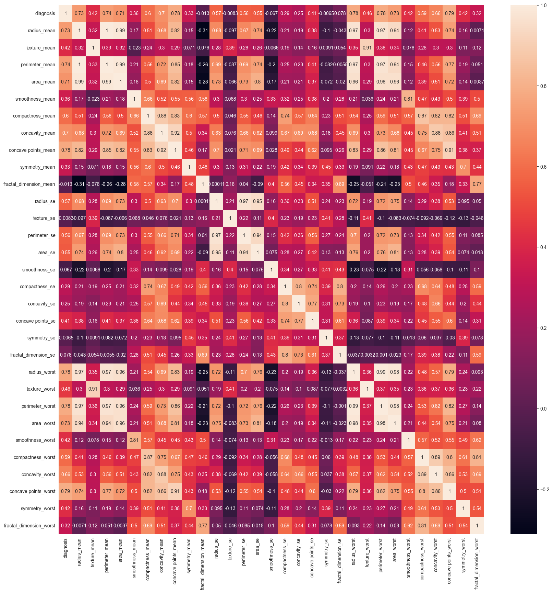
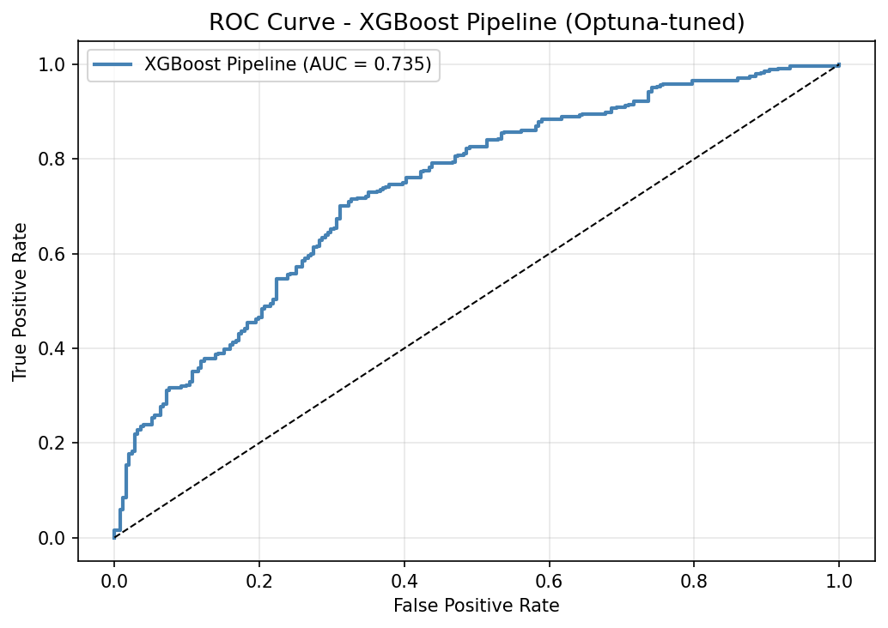
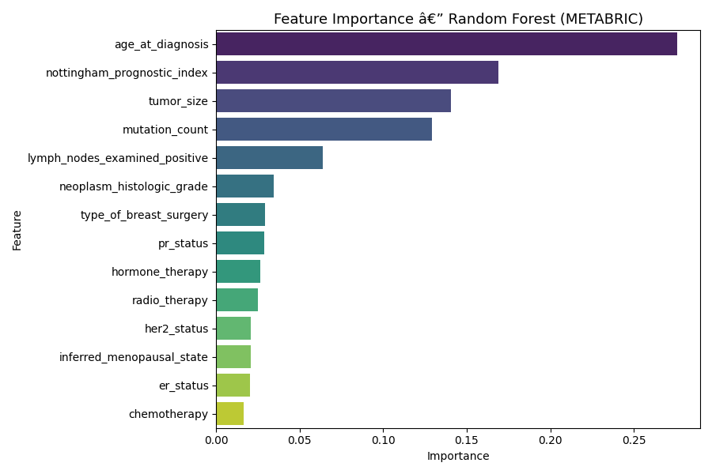

# Breast Cancer Classification using Machine Learning

## 🔬 Project Overview
Breast cancer is one of the most common cancers worldwide, and early detection significantly improves patient survival rates. This project applies machine learning techniques to classify breast tumors as **benign** or **malignant** using diagnostic measurements extracted from cell nuclei.

The project demonstrates an **end-to-end machine learning workflow**, including:

- Data preprocessing and exploratory analysis
- Training and comparing multiple machine learning models
- Model evaluation and interpretation
- Saving the trained model
- Deploying the model as a **REST API using FastAPI**
- **Containerizing the application using Docker** for reproducible deployment

The deployed API allows users to submit tumor feature measurements and receive real-time cancer predictions.

---

# 📊 Dataset

**Source:** UCI Machine Learning Repository – Breast Cancer Wisconsin Dataset  

Dataset characteristics:

- **Samples:** 569
- **Features:** 30 numerical diagnostic features
- **Target Variable:** Diagnosis (Malignant / Benign)

Each feature represents characteristics of cell nuclei such as:

- Radius
- Texture
- Perimeter
- Area
- Smoothness
- Compactness
- Concavity
- Symmetry

These measurements allow machine learning models to identify patterns associated with cancerous tumors.

---

# 🔧 Data Preprocessing

The following preprocessing steps were applied:

- Removed non-informative columns (`id`, unnamed column)
- Checked for missing values
- Reduced dimensionality by removing highly correlated features
- Handled outliers using value capping
- Encoded target variable (Malignant = 1, Benign = 0)
- Split dataset into **training and testing sets (70 / 30)**

These steps helped reduce noise and improve model generalization.

---

# 📈 Exploratory Data Analysis

EDA was performed to understand relationships between features and identify useful predictors.

## Diagnosis Distribution


The dataset contains slightly more **benign cases than malignant cases**, indicating mild class imbalance.

---

## Feature Correlation



Size-related features such as **radius, perimeter, and area** show strong correlations.

Understanding these correlations helps reduce redundancy and improve model performance.

---

## K-Means Clustering


Unsupervised clustering demonstrates that malignant and benign tumors naturally form separable groups.

---

# 🤖 Machine Learning Models

The following models were trained and evaluated:

| Model | Accuracy |
|------|---------|
| Logistic Regression | 97% |
| Support Vector Machine | **97% (Best)** |
| Random Forest | 95% |
| K-Nearest Neighbors | 95% |
| Decision Tree | 94% |
| Naive Bayes | 93% |

---

# 📊 Model Evaluation

The **Support Vector Machine (SVM)** achieved the best performance with **97% accuracy**.

### Confusion Matrix


The model demonstrates strong precision and recall for both malignant and benign tumor detection.

---

# 📊 Model Comparison


---

# 📈 ROC Curve



The ROC curve shows strong classification capability across different decision thresholds.

---

# 🔍 Feature Importance



Feature importance analysis highlights the most influential tumor characteristics used by the model.

---

# 🔬 Model Explainability (SHAP)


SHAP values were used to interpret model predictions and understand how each feature contributes to classification.

This improves **model transparency**, which is especially important for healthcare applications.

---

# 🚀 Model Deployment

The trained model was exported using **Joblib** and deployed using **FastAPI**.

FastAPI provides a REST interface that allows users to send tumor feature measurements and receive predictions.

### Example Prediction Request

```
POST /predict
```

Example input:

```json
{
  "radius_mean": 14.5,
  "texture_mean": 20.3,
  "perimeter_mean": 90.2,
  "area_mean": 600.5,
  "smoothness_mean": 0.1,
  "compactness_mean": 0.15,
  "concavity_mean": 0.12,
  "concave_points_mean": 0.05,
  "symmetry_mean": 0.18,
  "fractal_dimension_mean": 0.07,
  "radius_se": 0.5,
  "texture_se": 0.2
}
```

Example response:

```json
{
 "prediction": "Benign tumor detected"
}
```

---

# 🌐 API Documentation

FastAPI automatically generates interactive documentation.

API interface available at:

```
http://localhost:8000/docs
```

Users can test predictions directly from the browser.

---

# 🐳 Docker Containerization

The application is containerized using **Docker** to ensure consistent deployment across environments.

Docker packages:

- Python environment
- dependencies
- trained model
- API server

### Build Docker Image

```bash
docker build -t breast-cancer-api .
```

### Run Container

```bash
docker run -p 8000:8000 breast-cancer-api
```

Open:

```
http://localhost:8000/docs
```

---

# 🛠 Technologies Used

- Python
- Pandas
- NumPy
- Scikit-learn
- Matplotlib
- Seaborn
- SHAP
- FastAPI
- Docker
- Uvicorn
- Jupyter Notebook

---

# 📘 What I Learned

Through this project I learned:

- Building an end-to-end machine learning workflow
- Comparing classification models using multiple evaluation metrics
- Interpreting model predictions using SHAP
- Deploying machine learning models as REST APIs
- Containerizing ML applications using Docker

---

# 📂 Project Structure

```
Breast-Cancer-ML
│
├── data
│
├── images
│
├── notebooks
│   └── Breast-Cancer-Analysis.ipynb
│
├── models
│   └── breast_cancer_model.pkl
│
├── api
│   └── api.py
│
├── requirements.txt
├── Dockerfile
└── README.md
```

---

# ▶️ How to Run the Project

Install dependencies:

```bash
pip install -r requirements.txt
```

Run API:

```bash
python -m uvicorn api.api:app --reload
```

Open API documentation:

```
http://localhost:8000/docs
```

---

# 🔮 Future Improvements

Potential improvements include:

- Advanced feature engineering
- Hyperparameter optimization
- Ensemble models
- Cloud deployment (AWS / GCP)
- Building a user interface for tumor prediction

---

# ⭐ Project Goal

This project demonstrates how machine learning can support **early cancer detection** while showcasing the full lifecycle of an ML system from **data analysis to deployment**.
