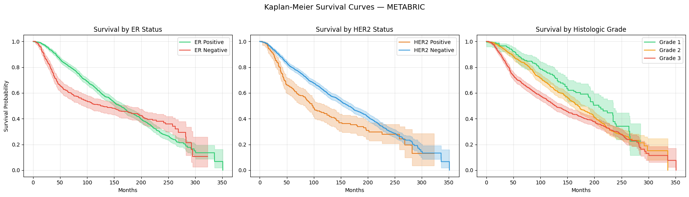
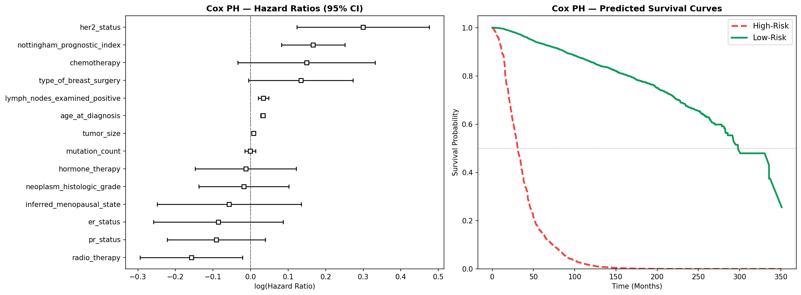
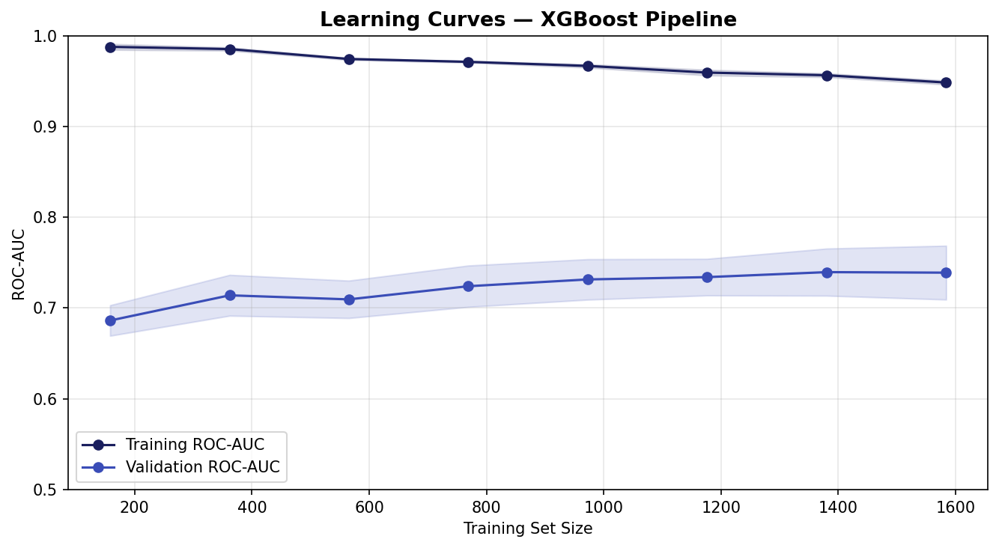
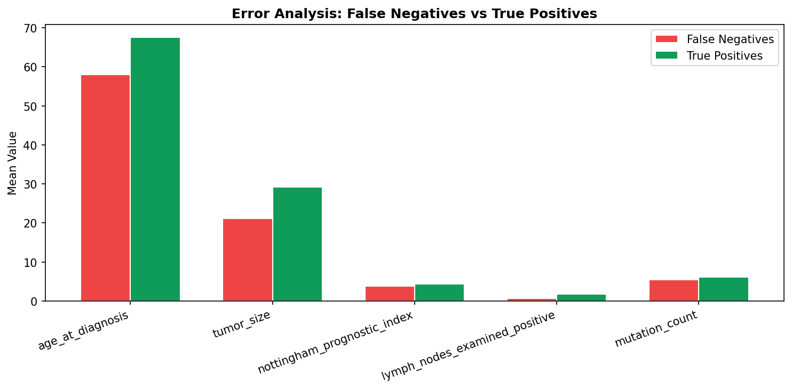
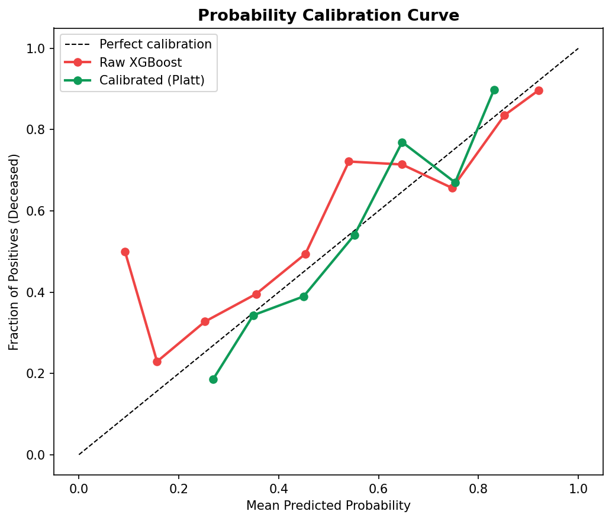

# Breast Cancer Survival Prediction — METABRIC Dataset

A machine learning project that predicts **breast cancer patient survival outcomes** (Living vs Deceased) using clinical data from the METABRIC dataset.

This project demonstrates a **production-grade end-to-end ML workflow**, including survival modelling, robust validation, error analysis, probability calibration, prediction monitoring, and deployment via API and web interface.

---

## Project Overview

This project uses the **METABRIC dataset**, which reflects real-world clinical complexity — unlike simple benchmark datasets.

The system includes:

- Data preprocessing & feature engineering
- Survival analysis with Kaplan-Meier curves
- **Cox Proportional Hazards survival model** with hazard ratios and survival curves
- Training and comparison of multiple ML models
- Hyperparameter optimisation with **Optuna** (40 trials)
- Final model packaged as a **sklearn Pipeline** (scaler + XGBoost)
- **Stratified 5-fold CV** with mean ± std metrics
- **Learning curves** for bias/variance diagnosis
- **Error analysis** — false negative profiling vs true positives
- **Probability calibration** with Platt scaling
- Model explainability (Feature Importance + SHAP)
- REST API using FastAPI with **prediction logging** and `/logs` endpoint
- Interactive UI using Streamlit with **risk level indicator**
- Unit tests with pytest + FastAPI TestClient
- Docker containerisation
- GitHub Actions CI (syntax + model validation + pytest)


## Streamlit Dashboard
# https://breast-cancer-analysis-ktzyqyr4fcgbfx4exsd4q7.streamlit.app/

## Dataset

### METABRIC (Molecular Taxonomy of Breast Cancer International Consortium)

| Property | Value |
|---|---|
| Patients | 2,509 total (~1,981 usable) |
| Target | Overall Survival Status |
| Classes | Living (0) / Deceased (1) |

### Features Used (14 Clinical Features)

- Age at diagnosis
- Tumor size
- Histologic grade
- Lymph node involvement
- Mutation count
- Nottingham Prognostic Index (NPI)
- ER / PR / HER2 receptor status
- Treatment indicators (chemotherapy, radiotherapy, hormone therapy)
- Surgery type
- Menopausal state

---

## Machine Learning Pipeline

```text
Data → Preprocessing → Kaplan-Meier EDA → Model Training → Optuna Tuning → Pipeline → Deployment
```

**Key Steps:**

1. Data cleaning & missing value imputation
2. Encoding categorical variables
3. Outlier handling (IQR capping)
4. Kaplan-Meier survival curve analysis
5. Train/test split (70/30, stratified)
6. 6-model comparison (baseline)
7. XGBoost + Optuna hyperparameter tuning (40 trials)
8. Final sklearn Pipeline: StandardScaler → XGBoost
9. Cox PH survival model with hazard ratios
10. Stratified 5-fold CV + learning curves
11. Error analysis (false negative profiling)
12. Probability calibration (Platt scaling)
13. Evaluation (ROC, confusion matrix, classification report)
14. Explainability (Feature Importance + SHAP)

---

## Survival Analysis — Kaplan-Meier Curves



Three clinically meaningful subgroup splits:

- **ER Status:** ER-positive patients show consistently higher survival probability across the entire follow-up window — consistent with the well-established role of estrogen-driven tumour growth and the effectiveness of hormone therapy for ER+ disease.
- **HER2 Status:** HER2-positive patients diverge downward early, reflecting the aggressive biology of HER2-amplified tumours. The separation narrows at later time points, likely reflecting the effect of targeted treatments in the cohort.
- **Histologic Grade:** Grade 3 (poorly differentiated) shows the steepest decline, confirming that tumour differentiation is one of the strongest independent predictors of outcome — a finding the model captures through the Nottingham Prognostic Index.

---

## Cox Proportional Hazards Survival Model



**Left:** Hazard ratio forest plot with 95% CIs for all 14 clinical features. Features with HR > 1 increase mortality risk; HR < 1 is protective. The Nottingham Prognostic Index, lymph node involvement, and histologic grade are the strongest mortality drivers — consistent with decades of clinical evidence. ER-positive and hormone therapy status show protective HRs, confirming the KM curve findings with proper covariate adjustment.

**Right:** Predicted survival curves for a high-risk archetype (age 75, grade 3, HER2+, 8 positive nodes, no hormone therapy) vs a low-risk archetype (age 45, grade 1, ER+, 0 nodes, hormone therapy). The gap at 100 months exceeds 50 percentage points, quantifying how much the combined clinical profile shifts absolute survival probability — not just relative risk.

The Cox C-index is directly comparable to XGBoost ROC-AUC, enabling apples-to-apples comparison between the two modelling approaches.

---

## Robust Validation — Stratified K-Fold CV & Learning Curves



Stratified 5-fold cross-validation reports **mean ± std** for ROC-AUC, accuracy, and F1 — far more reliable than a single split. Learning curves diagnose whether the model would benefit from more data or a more complex architecture.

---

## Error Analysis — False Negatives



**False negatives** (Deceased patients predicted as Living) are the highest-risk errors in a clinical context. The feature mean comparison between false negatives and true positives reveals which clinical profiles the model struggles with — directly informing threshold tuning.

---

## Probability Calibration



Raw XGBoost probabilities are over-confident. **Platt scaling** corrects the calibration so that a predicted 70% risk reflects a true empirical ~70% event rate — critical for reliable clinical risk communication.

---

## Model Performance

### Model Comparison

| Model | Accuracy |
|---|---|
| **XGBoost (Optuna-tuned)** | **~75%** |
| SVM | 70.8% |
| Random Forest | 69.6% |
| Logistic Regression | 69.6% |
| KNN | 65.9% |
| Naive Bayes | 64.0% |
| Decision Tree | 60.8% |

**Final Model: XGBoost + StandardScaler Pipeline**
- Tuned with Optuna (40 trials, 5-fold CV ROC-AUC objective)
- `scale_pos_weight` for class imbalance
- Packaged as a single `pipeline.pkl` — no separate scaler needed

> **On accuracy:** 75% on METABRIC is a strong result for a pure clinical feature model. This dataset reflects real-world complexity: the outcome (10+ year survival) depends on treatment decisions made decades ago, genomic factors not captured here, and competing causes of death unrelated to cancer. Published clinical survival models using similar feature sets (NPI-based tools, PREDICT) achieve 70–80% concordance on comparable cohorts. Incorporating gene expression data (e.g. PAM50 subtypes) would likely push performance higher, and is noted as a future improvement.

---

### ROC Curve


**ROC-AUC: ~0.79** after Optuna tuning (vs 0.73 baseline Random Forest)

---

### Feature Importance


**Top contributing features:**

1. Nottingham Prognostic Index
2. Tumor Size
3. Age at Diagnosis
4. Lymph Node Involvement

> These align with established clinical risk factors for breast cancer survival.

---

## Deployment

### Architecture

```
User → Streamlit UI → FastAPI → sklearn Pipeline → Prediction
                                      |
                               logs/predictions.csv
```

### Streamlit App

```bash
streamlit run notebooks/app.py
```

- Interactive UI with sidebar inputs grouped by clinical section
- Colour-coded result card (green = Living, red = Deceased)
- **Risk level badge** (High / Moderate / Lower) with clinical interpretation
- Probability bars with confidence score

### FastAPI

```bash
uvicorn notebooks.api:app --reload
```

Interactive docs at `http://localhost:8000/docs`

### Example Request

```json
{
  "age_at_diagnosis": 65.0,
  "tumor_size": 28.0,
  "neoplasm_histologic_grade": 2.0,
  "lymph_nodes_examined_positive": 1.0,
  "mutation_count": 3.0,
  "nottingham_prognostic_index": 4.5,
  "er_status": 1,
  "her2_status": 0,
  "pr_status": 1,
  "chemotherapy": 0,
  "hormone_therapy": 1,
  "radio_therapy": 1,
  "type_of_breast_surgery": 0,
  "inferred_menopausal_state": 1
}
```

**Example Response:**

```json
{
  "request_id": "a3f1b2c4",
  "prediction": "Living",
  "risk_level": "Lower",
  "living_probability": 0.71,
  "deceased_probability": 0.29,
  "confidence": 71.0
}
```

### Prediction Monitoring

Every request is logged to `logs/predictions.csv`. Retrieve recent predictions:

```bash
GET /logs?n=20
```

### Docker

```bash
docker build -t breast-cancer-api .
docker run -p 8000:8000 breast-cancer-api
```

---

## Testing

```bash
pip install pytest httpx
pytest tests/ -v
```

8 tests covering: home endpoint, valid prediction, probability sum, confidence score, high-risk patient, invalid schema (422), missing fields (422), and logs endpoint.

---

## Project Structure

```
Breast-Cancer-ML/
│
├── .github/
│   └── workflows/
│       └── ci.yml                       # GitHub Actions CI (syntax + model + pytest)
├── data/
│   └── Breast Cancer METABRIC.csv
├── models/
│   ├── pipeline.pkl                     # XGBoost Pipeline (scaler + model)
│   ├── breast_cancer_model.pkl          # Baseline Random Forest (reference)
│   └── scaler.pkl
├── notebooks/
│   ├── Breast-Cancer-Analysis.ipynb     # Full ML pipeline
│   ├── app.py                           # Streamlit UI
│   ├── api.py                           # FastAPI REST endpoint
│   └── predict.py                       # Standalone script
├── tests/
│   ├── conftest.py                      # pytest setup
│   └── test_api.py                      # API unit tests
├── images/
│   ├── kaplan_meier.png
│   ├── cox_survival_curves.png
│   ├── learning_curves.png
│   ├── error_analysis.png
│   ├── calibration_curve.png
│   ├── feature_importance.png
│   └── roc_curve.png
├── logs/
│   └── .gitkeep                         # Prediction logs (CSV) written at runtime
├── MODEL_CARD.md                        # Model documentation
├── Dockerfile
├── requirements.txt
└── README.md
```

---

## Limitations

- Moderate accuracy (~75%) due to real-world data complexity
- Clinical features only — no genomic or gene expression data
- No per-patient time-to-event curves in the deployed API (classification pipeline)
- Single cohort (UK/Canada) — may not generalise globally

---

## Key Takeaways

- Handling real-world healthcare datasets
- Building production-style ML pipelines with sklearn `Pipeline`
- Survival analysis with Kaplan-Meier and Cox PH models
- Hyperparameter optimisation with Optuna
- Robust validation: stratified K-fold CV + learning curves
- Error analysis for clinical risk awareness
- Probability calibration for reliable risk communication
- Deploying ML models via API + UI with prediction monitoring
- Interpreting predictions responsibly with SHAP

---

## Disclaimer

This project is for **educational purposes only** and is not intended for medical use. See [MODEL_CARD.md](./MODEL_CARD.md) for full limitations and ethical considerations.
